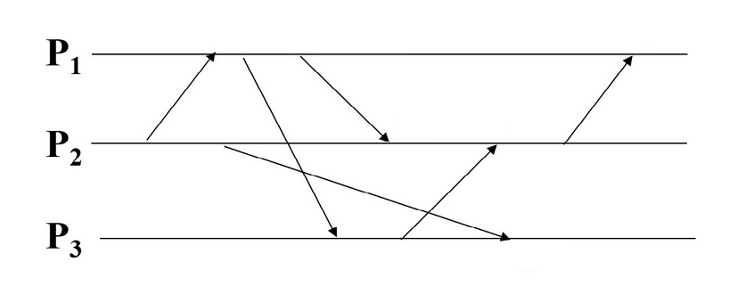

# Exercises for Distributed Systems
This repository contains a small framework written in python for emulating *asynchronous* and *synchronous* distributed systems.

## General
Exercises will be described later in this document.

In general avoid changing any of the files in the `emulators` subdirectory.
Instead, restrict your implementation to extending `emulators.Device` and `emulators.MessageStub`.

Your implementation/solution for, for instance, exersice 1 should go into the `exercises/exercise1.py` document.
I will provide new templates as the course progresses.

You should be able to execute your solution to exercise 1 using the following lines:
```bash
python3.9 exercise_runner.py --lecture 1 --algorithm Gossip --type sync --devices 3
python3.9 exercise_runner.py --lecture 1 --algorithm Gossip --type async --devices 3
```

The first line will execute your implementation of the `Gossip` algorithm in a synchronous setting with three devices, 
while the second line will execute in an asynchronous setting.

For usage of the framework, see `exercises/demo.py` for a lightweight example.
The example can be run with:
```bash
python3.9 exercise_runner.py --lecture 0 --algorithm PingPong --type async --devices 3
```

## Pull Requests
If you have any extensions or improvements you are welcome to create a pull request.

However, pull requests should provide some *significant* improvement, changes in style, renaming of variables etc. 
is strongly discouraged: such changes would likely break the solutions of your fellow students.

# Exercise 1
Implement the following gossiping problem in `exercises/exercise1.py`.

A number of persons initially know one distinct secret each.

In each message, a person discloses all their secrets to the recipient.

These individuals can communicate only in pairs (no conference calls) but it is possible that different pairs of people talk concurrently. For all the tasks below you should consider the following two scenarios:

 - Scenario 1: a person may call any other person, thus the network is a total graph,
 - Scenario 2: the persons are organized in a bi-directional circle, where the each person can only pass messages to the left and the right (use the modulo operator).

In both scenarios you should use the `async` network, details of the differences between `sync` and `async` will be given in the third lecture.

Your tasks are as follows:

 - implement the above behaviour - however, with the freedom to pick which person to talk to, when to send a message, etc. 
 - Try to minimize the number of messages.
 - How few messages are enough?
 - Is your solution optimal? And in what sense?

### NOTICE:
You can have several copies of the `Gossip` class, just give the class another name in the `exercise1.py` document, for instance `ImprovedGossip`.
You should then be able to call the framework with your new class via:
```bash
python3.9 exercise_runner.py --lecture 1 --algorithm ImprovedGossip --type async --devices 3
```

# Exercise 2
1. Implement the RIP protocol (fill in missing code in merge_tables), described in \[DS, fifth edition\] Page 115-118.
2. In the `__init__` of `RipCommunication`, create a ring topology (that is, set up who are the neighbors of each device). Consider a ring size of 10 devices.
   1. How many messages are sent in total before the routing_tables of all nodes are synchronized?
   2. How can you "know" that the routing tables are complete and you can start using the network to route packets? Consider the general case of internet, and the specific case of our toy ring network. 
   3. For the ring network, consider an approach similar to
      1. ```python
         def routing_table_complete(self):
           if len(self.routing_table) < self.number_of_devices()-1:
               return False
           return True
         ```
         Does it work? Each routing table should believe it is completed just one. How many times the routing tables appear to be completed?
   4. Try this other approach, which works better:
      1. ```python
         def routing_table_complete(self):
           if len(self.routing_table) < self.number_of_devices()-1:
               return False
           for row in self.routing_table:
               (next_hop, distance) = self.routing_table[row]
               if distance > (self.number_of_devices()/2):
                   return False
              return True
         ```
    Is it realistic for a real network?
3. Send a `RoutableMessage` after the routing tables are ready. Consider the termination problem. Can a node quit right after receiving the `RoutingMessage` for itself? What happens to the rest of the nodes?
4. What happens, if a link has a negative cost? How many messages are sent before the `routing_tables` converge?

# Exercise 3
Please consult the moodle page, this exercise is not via this framework.

# Exercise 4
Look at `exercises/exercise4.py`, here you should find the `SuzukiKasami` class 
implementing Suzuki-Kasami’s Mutex Algorithm.

For all exercises today, you can use the `sync` network type - but most algorithms should work for `async` also.

1. Examine the algorithm 
    1. Make a doodle on the blackboard/paper showing a few processes, their state, and messages exchanged. Use e.g. a sequence diagram.
    2. Define the purpose of the vectors `_rn` and `_ln`.
2. Discuss the following situations
   1. Is it possible that a node receives a token request message after the corresponding request has been granted? Sketch a scenario.
   2. How can a node know which nodes have ungranted requests?
   3. How does the queue grow?

3. Characterize the algorithms performance and correctness:
   1. Is the algorithm correct? (ME1, ME2, ME3)
   2. How does it perform ? (bandwidth, enter/exit delay)
   3. How does it cope with failures? / How can it be made fault tolerant?

4. Bonus exercise, modifying the `TokenRing` class of `exercises/exercise4.py`:
   1. Implement heartbeats in the token-ring algorithm for failure detection,
   2. Make it robust against node-failiures, and
   3. Make it possible for new processes to join the ring.

5. Extracurricular exercise/challenge (only if you have nothing better to do over the weekend)
   1. Extend the mutex algorithm implementations s.t. the `do_work()` call starts an asynchronous process (e.g. a future) which later calls a `release()` method on the mutex classes.
   2. Check that the algorithms still work, and modify where needed.
   3. Submit a pull-request!

# Exercise 5
1. Identify two problems with IP-multicast
   1. What is a practical problem for IP-multicast? 
   2. What is a theoretical problem for IP-multicast?
   
2. Identify all the events in the following picture
   1. Compute the lamport clocks for each event
   2. Compute the vector clock for each event
   3. What is the difference in the orderings produced by vector and lamport clocks?




3. Design (and implement) Totally Ordered FIFO multicast (both requirements must be met).
   You can use the `TOSEQMulticast` from `exercise5.py` as a starting-point.

   1. Is it reliable? 
      1. if not, can it become so? 
      2. if it is, argue why!

4. Discuss FIFO ordering in two overlapping multicast groups
   1. FIFO is no longer guaranteed, how is it broken, and how do you fix it?

5. Bonus exercise: Fix the ISIS algorithm!
   1. Hint: how (and when) do you identify a tie?

# Exercise 6
1. Study the pseudo-code in the slides (on moodle) and complete the implement of the `King` Algorithm in `exercise6.py`
   1. How does the algorithm deal with a Byzantine king (try f=1, the first king is byzantine)?
   2. Why does the algorithm satisfy Byzantine integrity?
   3. Sketch/discuss a modification your implementation s.t. the algorithm works in an `async` network, but looses its termination guarantee
      1. What would happen with a Byzantine king?
      2. What would happen with a slow king?
      3. What about the combination of the above?
   
2. Bonus Exercise: Implement the Paxos algorithm in `exercise6.py`, see the pseudo-code on moodle (use the video for reference when in doubt) for the two interesting roles (proposer and acceptor).
   1. Identify messages send/received by each role
      1. Investigate `PAXOSNetwork`
   2. Implement each role but the learner
      1. Assume that each device is both a `Proposer` and an `Acceptor` (the `Learner` is provided)
      2. A class combining/forwarding messages is provided (`PAXOS`).
      3. Your job is to implement the missing functionality in `Proposer` and `Acceptor`, search for "TODO"
   3. Demonstrate that your code works in an `async` environment
      1. Try with a large number of devices (for instance 20 or 30)
   4. Discuss how you can use Paxos in "continued consensus" where you have to agree on the order of entries in a log-file

# Exercise 7
1. DS5ed 18.5, 18.13
2. Sketch an architecture for the following three systems: A bulletin board (simple reddit), a bank, a version control system (e.g. GIT)
   1. Identify the system types
   2. Which replication type is suitable, and for which parts of the system
   3. If you go for a gossip solution, what is a suitable update frequency?
3. BONUS Exercise: Implement the Bully algorithm (DS 5ed, page 660) in `exercise7.py`
   1. In which replication scheme is it useful?
   2. What is the "extra cost" of a new leader in replication?

# Exercise 8
1. Compare GFS and Chubby, and identify use cases that are better for one or the other solution.
2. Consider the code in `exercise8.py`, which sketches GFS, and complete the "append record" implementation.
   1. Take a look at how the GFS master is implemented, and how it translates file + chunk index to chunk handle
   2. Sketch a design for the "passive replication" solution of the GFS. Consider how many types of messages you need, when they should be sent, etc
   3. Implement your solution, starting from the handler of RecordAppendReqMessage of the GfsChunkserver class
   4. Try out your solution with a larger number of clients, to have more concurrent changes to the "file"
3. BONUS Exercise: Consider how to add shadow masters to the system. Clients and chunk servers will still interact with the first master to change the file system, but the shadow master can always work as read-only.

NOTICE: To execute the code, issue for example:
```bash
python3.9 exercise_runner.py --lecture 8 --algorithm GfsNetwork --type async --devices 7
```

# Exercise 9
1. Consider the code in `exercise9.py`, which sketches MapReduce, and complete it.
   1. The Master is pretty much complete, the same can be said for the client. Take a look at how the Master is supposed to interact with Mappers and Reducers
   2. Consider how to implement the Reducers. Take into account that we are simulating "local storage in the mappers" using memory
   3. Look for the TODOs, and implement your solution
   4. Try to change the number of mappers and reducers, and look at the "performance". In particular, look at how many rounds are needed to complete the job with the "sync" simulator.
2. Compare MapReduce and Spark RDDs, and consider what it would change in terms of architecture, especially to supprt RDDs

NOTICE: To execute the code, issue for example:
```bash
python3 exercise_runner.py --lecture 9 --algorithm MapReduceNetwork --type async --devices 6
```
